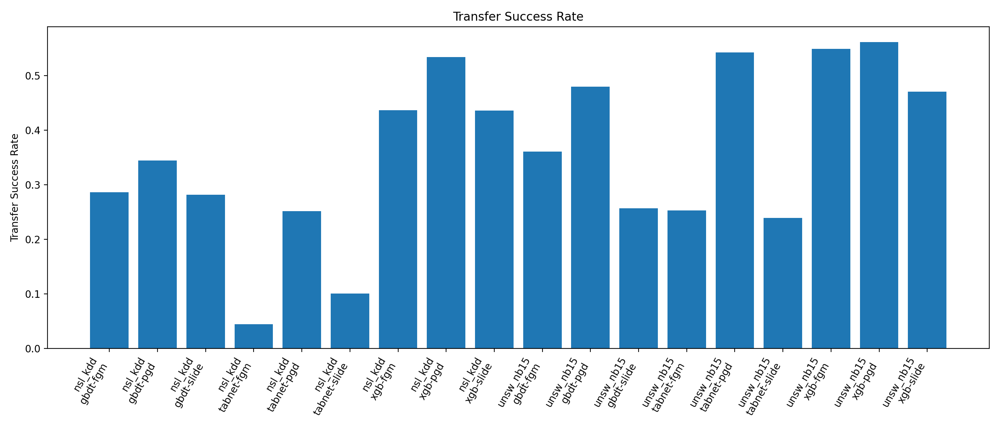
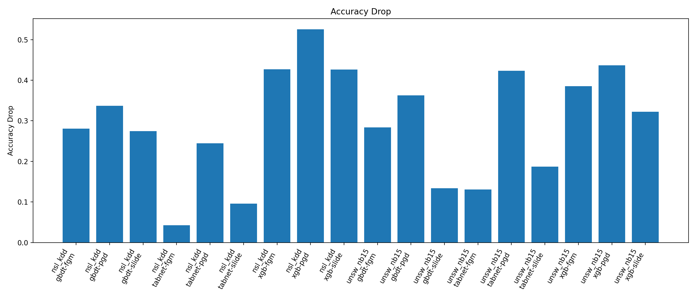
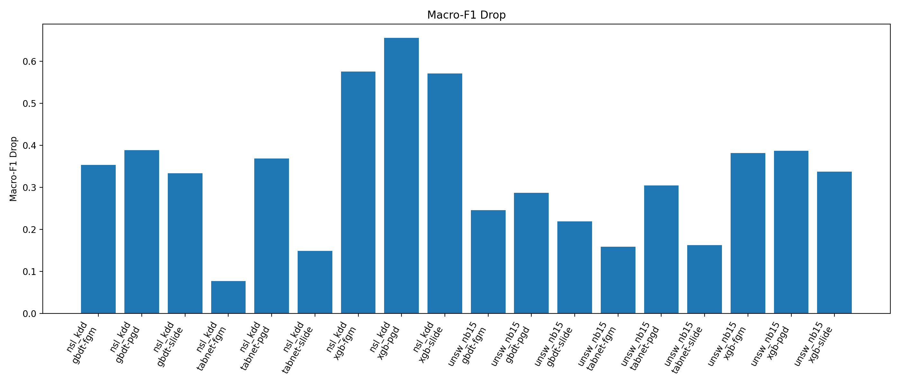
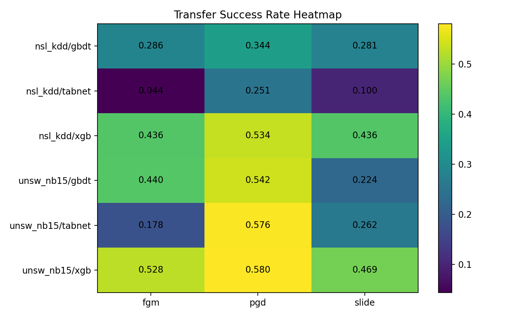
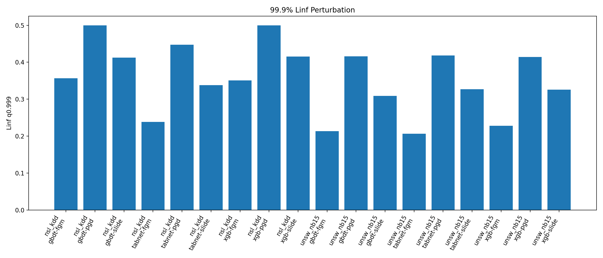

# 基于网络入侵检测的黑盒对抗攻击迁移研究

# Adversarial Attack Transfer for Network Intrusion Detection

本项目面向 **网络入侵检测系统（NIDS）** 的对抗鲁棒性评估，构建了一个基于 **MSM（Mixup-based Surrogate Model）黑盒迁移攻击框架** 的完整实验流水线。项目支持在 **NSL-KDD** 与 **UNSW-NB15** 两个公开网络流量数据集上，训练目标入侵检测模型、构建替代模型、生成对抗流量，并评估对抗样本在黑盒目标模型上的迁移攻击效果。

本项目当前重点实现并测试以下攻击方法：

- FGM
- PGD
- SLIDE

以下攻击文件暂时保留为后续扩展方向，当前不作为最终实验与报告结果的一部分：

- `cw.py`
- `mim.py`
- `ti.py`

---

## 1. 项目背景

随着人工智能技术在网络入侵检测中的广泛应用，基于机器学习和深度学习的 NIDS 已经成为网络安全防护的重要组成部分。相比传统规则检测方法，AI 驱动的 NIDS 能够更好地识别未知攻击和复杂异常行为。

但是，机器学习与深度学习模型存在对抗脆弱性。攻击者可以通过对输入流量特征施加微小扰动，使模型产生错误分类。由于真实部署场景中的入侵检测模型通常是黑盒模型，攻击者难以直接获取模型结构、参数和梯度信息，因此 **基于替代模型的迁移攻击** 成为评估黑盒 NIDS 对抗鲁棒性的重要方法。

本项目围绕以下问题展开：

1. 在网络流量表格特征场景下，如何构建高质量替代模型？
2. 不同目标模型之间的对抗样本迁移性有何差异？
3. FGM、PGD、SLIDE 等攻击方法在 NSL-KDD 和 UNSW-NB15 上的迁移效果如何？
4. 如何形成一套可复现实验、自动汇总结果、生成图表和报告的标准化流程？

---

## 2. 当前进度

| 模块                     | 状态                           |
| ---------------------- | ---------------------------- |
| NSL-KDD 数据预处理          | 已完成                          |
| UNSW-NB15 数据预处理        | 已完成                          |
| XGB 目标模型训练             | 已完成                          |
| GBDT 目标模型训练            | 已完成                          |
| TabNet 目标模型训练          | 已完成                          |
| MSM 替代模型训练             | 已完成                          |
| FGM 攻击生成与迁移评估          | 已完成                          |
| PGD 攻击生成与迁移评估          | 已完成                          |
| SLIDE 攻击生成与迁移评估        | 已完成                          |
| 参数搜索 `surrogate_sweep` | 已完成                          |
| 最终实验 `full_pipeline`   | 已完成                          |
| 结果汇总报告 `report`        | 已完成                          |
| 图表生成                   | 已接入 `results/summary/plots/` |
| C&W / MIM / TI         | 暂缓实现，后续扩展                    |

---

## 3. 项目目录结构

```text
Adversarial-Attack-Transfer/
├── main.py
├── README.md
├── requirements.txt
├── configs/
├── scripts/
│   ├── build_result_report.py
│   ├── summarize_transfer_matrix.py
│   └── ...
├── src/
│   ├── attacks/
│   │   ├── common.py
│   │   ├── fgm.py
│   │   ├── pgd.py
│   │   ├── slide.py
│   │   ├── cw.py      # 暂缓测试，后续扩展
│   │   ├── mim.py     # 暂缓测试，后续扩展
│   │   └── ti.py      # 暂缓测试，后续扩展
│   ├── augment/
│   ├── data/
│   ├── evaluation/
│   ├── models/
│   ├── preprocess/
│   ├── reporting/
│   └── transfer/
├── data/
│   ├── nsl_kdd/
│   ├── unsw_nb15/
│   ├── seeds/
│   ├── mixup/
│   ├── surrogate_train/
│   └── adversarial/
├── artifacts/
│   └── models/
└── results/
    ├── tables/
    ├── summary/
    │   ├── all_transfer_matrix.csv
    │   ├── all_transfer_matrix.md
    │   ├── all_metrics_detail.csv
    │   ├── result_summary.md
    │   └── plots/
    └── param_search/
```

---

## 4. 环境配置教程

### 4.1 克隆仓库

```powershell
git clone https://github.com/wangyh978/Adversarial-Attack-Transfer.git
cd Adversarial-Attack-Transfer
```

### 4.2 创建虚拟环境

Windows:

```powershell
python -m venv .venv
.\.venv\Scripts\activate
```

Linux / macOS:

```bash
python -m venv .venv
source .venv/bin/activate
```

### 4.3 安装依赖

```powershell
pip install -r requirements.txt
```

如果安装 TabNet 相关依赖较慢，可以单独安装：

```powershell
pip install pytorch-tabnet
```

---

## 5. 数据集准备

项目当前支持两个数据集：

| 数据集       | 任务类型 | 类别数 | 特征维度 | 当前实验划分                              |
| --------- | ----:| ---:| ----:| ----------------------------------- |
| NSL-KDD   | 多分类  | 5   | 116  | train=15780, val=3382, test=3382    |
| UNSW-NB15 | 多分类  | 10  | 190  | train=69982, val=12350, test=175341 |

数据文件需要放在以下位置：

```text
data/nsl_kdd/raw/
data/unsw_nb15/raw/
```

示例：

```text
data/nsl_kdd/raw/KDDTest+.txt

data/unsw_nb15/raw/UNSW_NB15_training-set.csv
data/unsw_nb15/raw/UNSW_NB15_testing-set.csv
```

---

## 6. 一键运行完整实验

### 6.1 NSL-KDD 最终实验

当前推荐参数：

```text
seed_size = 1000
alpha = 0.10
depth = 3
attacks = fgm, pgd, slide
targets = xgb, gbdt, tabnet
```

运行命令：

```powershell
python main.py nsl --stage full_pipeline --targets xgb gbdt tabnet --seed-size 1000 --alpha 0.10 --depth 3 --attacks fgm pgd slide --retrain-targets --run-report
```

### 6.2 UNSW-NB15 最终实验

当前推荐参数：

```text
seed_size = 1000
alpha = 0.10
depth = 4
attacks = fgm, pgd, slide
targets = xgb, gbdt, tabnet
```

运行命令：

```powershell
python main.py unsw --stage full_pipeline --targets xgb gbdt tabnet --seed-size 1000 --alpha 0.10 --depth 4 --attacks fgm pgd slide --retrain-targets --run-report
```

### 6.3 推荐运行方式

为了避免两个数据集的总报告相互覆盖，推荐先分别运行实验，最后统一生成报告：

```powershell
python main.py nsl --stage full_pipeline --targets xgb gbdt tabnet --seed-size 1000 --alpha 0.10 --depth 3 --attacks fgm pgd slide --retrain-targets

python main.py unsw --stage full_pipeline --targets xgb gbdt tabnet --seed-size 1000 --alpha 0.10 --depth 4 --attacks fgm pgd slide --retrain-targets

python main.py --stage report
```

---

## 7. 参数选择说明

### 7.1 NSL-KDD 参数选择

根据前期 `surrogate_sweep` 实验，NSL-KDD 上的稳定最优组合为：

```text
seed_size = 1000
alpha = 0.10
depth = 3
```

规律总结：

- `depth=3` 表现最稳定。
- `seed_size=1000` 在替代模型学习能力与过拟合风险之间较平衡。
- `alpha=0.10` 在迁移成功率和扰动约束之间较稳定。
- PGD 整体攻击最强。

### 7.2 UNSW-NB15 参数选择

根据 UNSW-NB15 的 `surrogate_sweep` 实验，推荐组合为：

```text
seed_size = 1000
alpha = 0.10
depth = 4
```

规律总结：

- UNSW-NB15 数据规模更大、类别更多，替代模型需要更深结构。
- `depth=4` 对 XGB 与 TabNet 表现较好。
- `alpha=0.10` 整体稳定。
- PGD 在三个目标模型上均表现最强。

---

## 8. 实验流程说明

完整流程如下：

```text
原始数据
  ↓
数据清洗与标签映射
  ↓
训练集 / 验证集 / 测试集划分
  ↓
特征工程与数值化
  ↓
训练目标模型 XGB / GBDT / TabNet
  ↓
构建少量种子样本 seed set
  ↓
查询目标模型输出标签 blackbox_label
  ↓
基于 mixup 构造增强样本
  ↓
构建 surrogate trainset
  ↓
训练 MLP surrogate 替代模型
  ↓
在 surrogate 上生成对抗样本 FGM / PGD / SLIDE
  ↓
迁移到目标黑盒模型评估
  ↓
生成 tables / summary / plots 报告
```

---

## 9. 核心评价指标

| 指标                      | 含义                  |
| ----------------------- | ------------------- |
| clean_accuracy          | 原始干净样本上的目标模型准确率     |
| adversarial_accuracy    | 对抗样本上的目标模型准确率       |
| accuracy_drop           | 准确率下降幅度             |
| clean_macro_f1          | 干净样本上的宏平均 F1        |
| adversarial_macro_f1    | 对抗样本上的宏平均 F1        |
| macro_f1_drop           | 宏平均 F1 下降幅度         |
| transfer_success_rate   | 迁移成功率               |
| mean_l2_perturbation    | 平均 L2 扰动            |
| mean_linf_perturbation  | 平均 Linf 扰动          |
| l2_q0.999 / linf_q0.999 | 高分位扰动，避免最大值被少量异常点误导 |
| structural_robustness   | 结构鲁棒性指标             |

本项目中迁移成功率定义为：

```text
transfer_success_rate = count(clean_correct and adv_wrong) / count(clean_correct)
```

即只统计原本被目标模型正确分类的样本，在加入对抗扰动后变为错误分类的比例。

---

## 10. 当前最终实验结果

以下结果来自最终运行命令：

```powershell
python main.py nsl --stage full_pipeline --targets xgb gbdt tabnet --seed-size 1000 --alpha 0.10 --depth 3 --attacks fgm pgd slide --retrain-targets --run-report

python main.py unsw --stage full_pipeline --targets xgb gbdt tabnet --seed-size 1000 --alpha 0.10 --depth 4 --attacks fgm pgd slide --retrain-targets --run-report
```

### 10.1 NSL-KDD 目标模型性能

| Target | Clean Accuracy | Clean Macro-F1 |
| ------ | --------------:| --------------:|
| XGB    | 0.9864         | 0.9698         |
| GBDT   | 0.9864         | 0.9668         |
| TabNet | 0.9752         | 0.9535         |

### 10.2 NSL-KDD 迁移攻击结果

| Target | Attack | Transfer Success Rate | Accuracy Drop | Macro-F1 Drop |
| ------ | ------ | ---------------------:| -------------:| -------------:|
| XGB    | FGM    | 0.4365                | 0.4270        | 0.5752        |
| XGB    | PGD    | 0.5339                | 0.5257        | 0.6561        |
| XGB    | SLIDE  | 0.4359                | 0.4261        | 0.5709        |
| GBDT   | FGM    | 0.2863                | 0.2806        | 0.3533        |
| GBDT   | PGD    | 0.3444                | 0.3371        | 0.3885        |
| GBDT   | SLIDE  | 0.2812                | 0.2747        | 0.3335        |
| TabNet | FGM    | 0.0440                | 0.0426        | 0.0770        |
| TabNet | PGD    | 0.2511                | 0.2445        | 0.3683        |
| TabNet | SLIDE  | 0.1004                | 0.0961        | 0.1489        |

NSL-KDD 结论：

- XGB 最容易受到迁移攻击。
- PGD 在三个目标模型上均为最强攻击。
- TabNet 在 NSL-KDD 上表现出更强鲁棒性。
- 推荐重点报告：`XGB + PGD`，迁移成功率为 `0.5339`。

---

### 10.3 UNSW-NB15 目标模型性能

| Target | Clean Accuracy | Clean Macro-F1 |
| ------ | --------------:| --------------:|
| XGB    | 0.7652         | 0.5188         |
| GBDT   | 0.7539         | 0.4942         |
| TabNet | 0.7519         | 0.4268         |

### 10.4 UNSW-NB15 迁移攻击结果

| Target | Attack | Transfer Success Rate | Accuracy Drop | Macro-F1 Drop |
| ------ | ------ | ---------------------:| -------------:| -------------:|
| XGB    | FGM    | 0.5275                | 0.3854        | 0.3737        |
| XGB    | PGD    | 0.5803                | 0.4367        | 0.4015        |
| XGB    | SLIDE  | 0.4686                | 0.3223        | 0.3366        |
| GBDT   | FGM    | 0.4396                | 0.2838        | 0.2693        |
| GBDT   | PGD    | 0.5421                | 0.3625        | 0.3103        |
| GBDT   | SLIDE  | 0.2242                | 0.1340        | 0.1879        |
| TabNet | FGM    | 0.1784                | 0.1305        | 0.1386        |
| TabNet | PGD    | 0.5764                | 0.4233        | 0.3060        |
| TabNet | SLIDE  | 0.2618                | 0.1869        | 0.1607        |

UNSW-NB15 结论：

- PGD 是最强攻击方法。
- `XGB + PGD` 达到最高迁移成功率 `0.5803`。
- `TabNet + PGD` 也达到 `0.5764`，说明 UNSW-NB15 上 TabNet 对 PGD 的迁移攻击更敏感。
- UNSW-NB15 整体迁移性强于 NSL-KDD。

---

## 11. 图表展示

运行报告命令后：

```powershell
python main.py --stage report
```

图表应生成在：

```text
results/summary/plots/
```

README 中可直接展示以下图：

### 11.1 迁移成功率柱状图



### 11.2 准确率下降柱状图



### 11.3 Macro-F1 下降柱状图



### 11.4 迁移成功率热力图



### 11.5 99.9% Linf 扰动分位数



如果上述图片没有显示，请确认文件是否存在：

```powershell
dir results\summary\plots
```

---

## 12. 输出结果说明

### 12.1 表格结果

```text
results/tables/
```

典型文件：

```text
transfer_fgm_nsl_kdd_xgb.csv
transfer_fgm_nsl_kdd_xgb_metrics.json
final_transfer_matrix_nsl_kdd_xgb.csv
final_transfer_matrix_unsw_nb15_tabnet.csv
```

### 12.2 总结报告

```text
results/summary/
```

典型文件：

```text
results/summary/all_transfer_matrix.csv
results/summary/all_transfer_matrix.md
results/summary/all_metrics_detail.csv
results/summary/result_summary.md
results/summary/plots/
```

### 12.3 对抗样本

```text
data/adversarial/nsl_kdd/
data/adversarial/unsw_nb15/
```

示例：

```text
data/adversarial/nsl_kdd/pgd_xgb_seed1000_a0.1_d3.parquet
data/adversarial/unsw_nb15/pgd_tabnet_seed1000_a0.1_d4.parquet
```

### 12.4 模型文件

```text
artifacts/models/
```

示例：

```text
artifacts/models/surrogate_nsl_kdd_xgb_seed1000_a0.1_d3.pt
artifacts/models/surrogate_unsw_nb15_tabnet_seed1000_a0.1_d4.pt
artifacts/models/tabnet_nsl_kdd.zip
artifacts/models/tabnet_unsw_nb15.zip
```

---

## 13. 单阶段运行命令

### 13.1 仅准备数据

```powershell
python main.py nsl --stage prepare
python main.py unsw --stage prepare
```

### 13.2 仅训练目标模型

```powershell
python main.py nsl --stage baseline --target xgb
python main.py nsl --stage baseline --target gbdt
python main.py nsl --stage baseline --target tabnet
```

### 13.3 构建替代模型

```powershell
python main.py nsl --stage surrogate --target xgb --seed-size 1000 --alpha 0.10 --depth 3
```

### 13.4 生成对抗样本

```powershell
python main.py nsl --stage generate_attack --target xgb --seed-size 1000 --alpha 0.10 --depth 3 --attacks pgd
```

### 13.5 评估迁移攻击

```powershell
python main.py nsl --stage attack_target --target xgb --seed-size 1000 --alpha 0.10 --depth 3 --attacks pgd
```

### 13.6 生成报告

```powershell
python main.py --stage report
```

---

## 14. 参数搜索命令

当前支持 `surrogate_sweep`：

```powershell
python main.py nsl --stage surrogate_sweep --targets xgb gbdt tabnet --core-only --attacks fgm pgd slide --run-report

python main.py unsw --stage surrogate_sweep --targets xgb gbdt tabnet --core-only --attacks fgm pgd slide --run-report
```

输出位置：

```text
results/param_search/
results/tables/
results/summary/
```

推荐选择规则：

1. 优先看 `transfer_success_rate`
2. 其次看 `accuracy_drop` 与 `macro_f1_drop`
3. 再检查扰动是否合理：`linf_q0.999`、`num_linf_gt_1`、`num_l2_gt_5`
4. 不建议只看 `max_linf_perturbation`，因为最大值容易受少量异常样本影响

---

## 15. 扰动异常说明

实验中可以观察到少量样本存在较大的 `max_l2_perturbation` 和 `max_linf_perturbation`。但从 `l2_q0.999` 和 `linf_q0.999` 来看，大部分样本扰动仍处于较小范围内。

建议论文或报告中表述为：

> 大部分对抗样本的扰动幅度被控制在较合理范围内，但由于流量特征归一化、边界裁剪或部分原始特征存在极端值，少量样本出现较大最大扰动。因此本文同时报告最大扰动和高分位扰动指标，以避免仅由极端样本导致的误判。

---

## 16. 当前关键结论

1. PGD 是当前最强攻击方法。
2. UNSW-NB15 的整体迁移攻击成功率高于 NSL-KDD。
3. NSL-KDD 上 XGB 最容易受到迁移攻击，TabNet 相对更稳健。
4. UNSW-NB15 上 XGB 与 TabNet 在 PGD 攻击下均表现出较高脆弱性。
5. MSM 替代模型可以在仅使用少量查询样本的黑盒条件下实现较有效的迁移攻击。
6. 高分位扰动指标比最大扰动更能反映整体扰动水平。
7. 当前最终实验使用 FGM、PGD、SLIDE；C&W、MIM、TI 暂不纳入最终测试。

---

## 17. 后续工作

- 完善 C&W 攻击在当前特征约束下的实现与测试。
- 补充 MIM、TI 等迁移增强攻击。
- 增加多替代模型 ensemble surrogate。
- 增加 GPU 加速配置。
- 优化 UNSW-NB15 上 surrogate 的类别不均衡问题。
- 增加 t-SNE / UMAP 对抗流量可视化。
- 增加更规范的论文实验表格自动导出功能。
- 增加防御实验，如对抗训练、特征压缩、输入净化等。
