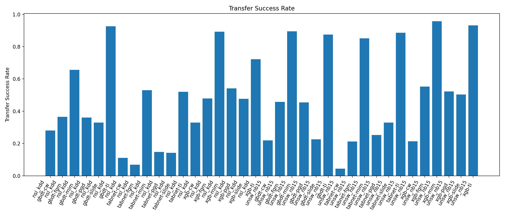
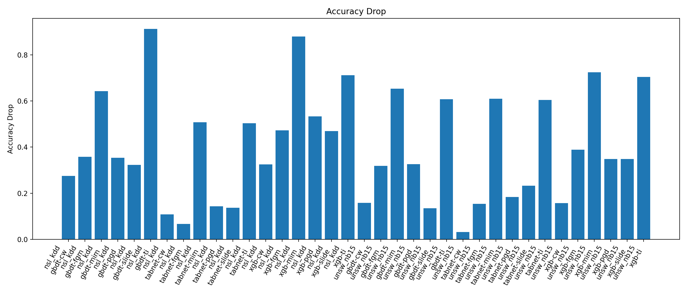
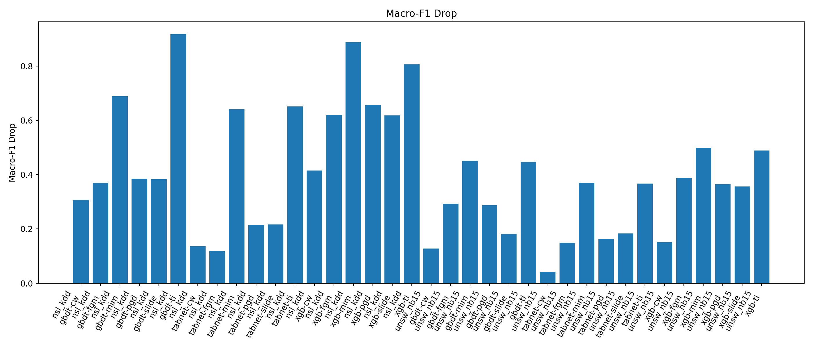
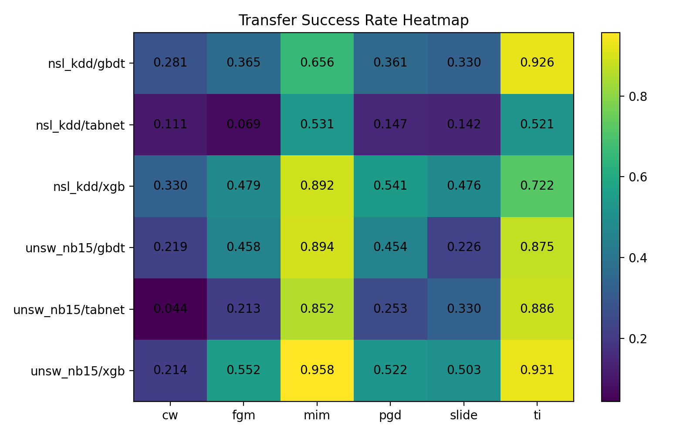
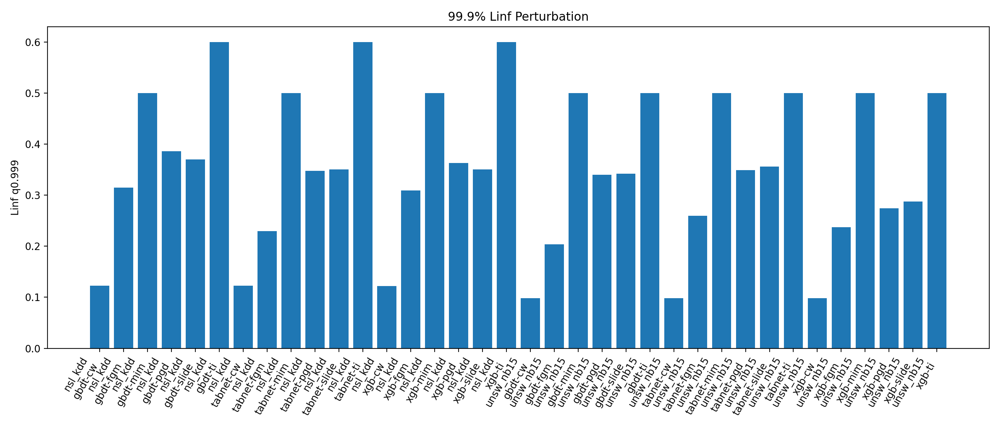

# 基于网络入侵检测的黑盒对抗攻击迁移研究

# Adversarial Attack Transfer for Network Intrusion Detection

本项目面向 **网络入侵检测系统（NIDS）** 的对抗鲁棒性评估，构建了一个基于 **MSM（Mixup-based Surrogate Model）黑盒迁移攻击框架** 的完整实验流水线。项目支持在 **NSL-KDD** 与 **UNSW-NB15** 两个公开网络流量数据集上，训练目标入侵检测模型、构建替代模型、生成对抗流量，并评估对抗样本在黑盒目标模型上的迁移攻击效果。

本项目当前已实现并接入统一流水线的攻击方法包括：

| 攻击方法 | 实现状态 | 说明 |
| -------- | -------- | ---- |
| FGM | 已接入 | 单步 L2 梯度攻击 |
| PGD | 已接入 | 迭代式 L2 投影梯度攻击 |
| SLIDE | 已接入 | 面向表格流量特征的稀疏迭代攻击，不再是 PGD 别名 |
| MIM | 已接入 | Linf 动量迭代攻击 |
| TI | 已接入 | 面向表格特征的平滑梯度迁移攻击 |
| C&W | 已接入 | Untargeted C&W-style L2 攻击 |

推荐在完整实验中显式传入 `--attacks fgm pgd slide mim ti cw`，以生成六类攻击的统一迁移评估结果。若不显式传入 `--attacks`，程序会使用 `fgm pgd slide` 作为快速 smoke run 默认序列；这只是运行默认值，不代表当前项目只支持三种攻击。

> 真实性说明：README 中关于数据集和攻击方法的描述均对应公开数据集或公开论文；关于“已接入”“已实现”的表述指本地代码链路已经存在。具体实验数值必须以本地运行后生成的 `results/tables/transfer_*_metrics.json` 和 `results/summary/all_transfer_matrix.csv` 为准，当前文档不编造或内嵌未落盘的六攻击结果。

---

## 1. 项目背景

随着人工智能技术在网络入侵检测中的广泛应用，基于机器学习和深度学习的 NIDS 已经成为网络安全防护的重要组成部分。相比传统规则检测方法，AI 驱动的 NIDS 能够更好地识别未知攻击和复杂异常行为。

但是，机器学习与深度学习模型存在对抗脆弱性。攻击者可以通过对输入流量特征施加微小扰动，使模型产生错误分类。由于真实部署场景中的入侵检测模型通常是黑盒模型，攻击者难以直接获取模型结构、参数和梯度信息，因此 **基于替代模型的迁移攻击** 成为评估黑盒 NIDS 对抗鲁棒性的重要方法。

本项目围绕以下问题展开：

1. 在网络流量表格特征场景下，如何构建高质量替代模型？
2. 不同目标模型之间的对抗样本迁移性有何差异？
3. FGM、PGD、MIM、TI、C&W、SLIDE 等攻击方法在 NSL-KDD 和 UNSW-NB15 上的迁移效果如何？
4. 如何形成一套可复现实验、自动汇总结果、生成图表和报告的标准化流程？

---

## 2. 当前进度

| 模块                     | 状态                           |
| ---------------------- | ---------------------------- |
| NSL-KDD 数据预处理          | 已完成                          |
| UNSW-NB15 数据预处理        | 已完成                          |
| XGB 目标模型训练             | 已完成                          |
| GBDT 目标模型训练            | 已完成                          |
| TabNet 目标模型训练          | 已完成                          |
| MSM 替代模型训练             | 已完成                          |
| 六类攻击生成与迁移评估链路         | 已实现，支持 `fgm / pgd / slide / mim / ti / cw` |
| 参数搜索 `surrogate_sweep` | 已完成                          |
| 最终实验 `full_pipeline`   | 已完成                          |
| 统一一键入口 `research_suite` | 已完成，并已完成统一接口链路测试 |
| 结果汇总报告 `report`        | 已实现，从本地 metrics 文件聚合生成 |
| 图表生成                   | 已接入 `results/summary/plots/` |
| 攻击参数覆盖与调参              | 已完成，支持 MIM / TI / C&W 参数网格搜索与 tagged 输出 |
| 新版对抗样本数据结构            | 已完成，保存对抗特征、配对干净特征、真实标签与样本索引 |
| 完整六攻击结果文件              | 待本地运行产出或复核；当前工作区未发现完整汇总文件 |

---

## 3. 项目目录结构

```text
Adversarial-Attack-Transfer/
├── main.py
├── README.md
├── requirements.txt
├── configs/
├── scripts/
│   ├── build_result_report.py
│   ├── summarize_transfer_matrix.py
│   └── ...
├── src/
│   ├── attacks/
│   │   ├── common.py
│   │   ├── fgm.py
│   │   ├── pgd.py
│   │   ├── slide.py
│   │   ├── cw.py      # C&W L2 attack
│   │   ├── mim.py     # Momentum Iterative Method
│   │   └── ti.py      # Translation-Invariant style attack for tabular features
│   ├── augment/
│   ├── data/
│   ├── evaluation/
│   ├── models/
│   ├── preprocess/
│   ├── reporting/
│   └── transfer/
├── data/
│   ├── nsl_kdd/
│   ├── unsw_nb15/
│   ├── seeds/
│   ├── mixup/
│   ├── surrogate_train/
│   └── adversarial/
├── artifacts/
│   ├── models/
│   └── metadata/
└── results/
    ├── tables/
    │   └── attack_sweeps/
    ├── summary/
    │   ├── all_transfer_matrix.csv
    │   ├── all_transfer_matrix.md
    │   ├── result_summary.md
    │   └── plots/
    └── param_search/
```

---

## 4. 环境配置教程

### 4.1 克隆仓库

```powershell
git clone https://github.com/wangyh978/Adversarial-Attack-Transfer.git
cd Adversarial-Attack-Transfer
```

### 4.2 创建虚拟环境

Windows:

```powershell
python -m venv .venv
.\.venv\Scripts\activate
```

Linux / macOS:

```bash
python -m venv .venv
source .venv/bin/activate
```

### 4.3 安装依赖

```powershell
pip install -r requirements.txt
```

如果安装 TabNet 相关依赖较慢，可以单独安装：

```powershell
pip install pytorch-tabnet
```

---

## 5. 数据集准备

项目当前支持两个数据集：

| 数据集       | 任务类型 | 类别数 | 特征维度 | 当前实验划分                              |
| --------- | ----:| ---:| ----:| ----------------------------------- |
| NSL-KDD   | 多分类  | 5   | 116  | train=15780, val=3382, test=3382    |
| UNSW-NB15 | 多分类  | 10  | 190  | train=69982, val=12350, test=175341 |

数据文件需要放在以下位置：

```text
data/nsl_kdd/raw/
data/unsw_nb15/raw/
```

示例：

```text
data/nsl_kdd/raw/KDDTest+.txt

data/unsw_nb15/raw/UNSW_NB15_training-set.csv
data/unsw_nb15/raw/UNSW_NB15_testing-set.csv
```

---

## 6. 一键运行完整实验

现在推荐直接使用 `main.py` 的统一入口 `research_suite`。

### 6.1 单数据集完整实验

`NSL-KDD`：

```powershell
python main.py nsl --stage research_suite --attacks fgm pgd slide mim ti cw --run-report
```

`UNSW-NB15`：

```powershell
python main.py unsw --stage research_suite --attacks fgm pgd slide mim ti cw --run-report
```

说明：

- 该入口会自动执行：`prepare -> 三个目标模型训练 -> surrogate 构建 -> 多攻击迁移评估 -> 汇总报告`
- 默认优先读取 `artifacts/metadata/best_surrogate_sweep_<dataset>_<target>.json`
- 如果不存在最优配置元数据，则回退到当前仓库的推荐默认值
- 当前统一入口已完成链路测试，可统一调度 `fgm / pgd / slide / mim / ti / cw` 六类攻击
- 如果需要复用已经训练好的目标模型和 surrogate，可增加 `--reuse-existing-artifacts` 以只重新生成和评估攻击结果

### 6.2 两个数据集一起跑

```powershell
python main.py all --stage research_suite --attacks fgm pgd slide mim ti cw --run-report
```

这个命令会按顺序跑：

1. `nsl_kdd`
2. `unsw_nb15`
3. 汇总生成 `results/summary/`

### 6.3 单阶段入口参考

如果只需要跑单数据集的 `full_pipeline`，也可以使用同一组六攻击参数：

```powershell
python main.py nsl --stage full_pipeline --targets xgb gbdt tabnet --attacks fgm pgd slide mim ti cw --run-report

python main.py unsw --stage full_pipeline --targets xgb gbdt tabnet --attacks fgm pgd slide mim ti cw --run-report
```

如果希望 `full_pipeline` / `full_attack_matrix` / `transfer_only` 这类阶段自动采用已筛出的最佳 surrogate 参数，可加上：

```powershell
--use-best-surrogate-config
```

---

## 7. 参数选择说明

说明：

- 使用 `research_suite` 时，会优先按 `best_surrogate_sweep_<dataset>_<target>.json` 为每个目标模型分别选择 `seed_size / alpha / depth`
- 只有在显式传入 `--seed-size`、`--alpha`、`--depth` 时，才会覆盖自动读取到的最佳配置
- 因此下面的固定参数更适合作为回退默认值或单阶段命令参考

### 7.1 NSL-KDD 参数选择

根据前期 `surrogate_sweep` 实验，NSL-KDD 上的稳定最优组合为：

```text
seed_size = 1000
alpha = 0.10
depth = 3
```

规律总结：

- `depth=3` 表现最稳定。
- `seed_size=1000` 在替代模型学习能力与过拟合风险之间较平衡。
- `alpha=0.10` 在迁移成功率和扰动约束之间较稳定。
- 六攻击完整对比请以 `results/summary/all_transfer_matrix.csv` 中的最新汇总为准。

### 7.2 UNSW-NB15 参数选择

根据 UNSW-NB15 的 `surrogate_sweep` 实验，推荐组合为：

```text
seed_size = 1000
alpha = 0.10
depth = 4
```

规律总结：

- UNSW-NB15 数据规模更大、类别更多，替代模型需要更深结构。
- `depth=4` 对 XGB 与 TabNet 表现较好。
- `alpha=0.10` 整体稳定。
- 六攻击完整对比请以 `results/summary/all_transfer_matrix.csv` 中的最新汇总为准。

---

## 8. 实验流程说明

完整流程如下：

```text
原始数据
  ↓
数据清洗与标签映射
  ↓
训练集 / 验证集 / 测试集划分
  ↓
特征工程与数值化
  ↓
训练目标模型 XGB / GBDT / TabNet
  ↓
构建少量种子样本 seed set
  ↓
查询目标模型输出标签 blackbox_label
  ↓
基于 mixup 构造增强样本
  ↓
构建 surrogate trainset
  ↓
训练 MLP surrogate 替代模型
  ↓
在 surrogate 上生成对抗样本 FGM / PGD / MIM / TI / C&W / SLIDE
  ↓
迁移到目标黑盒模型评估
  ↓
生成 tables / summary / plots 报告
```

---

## 9. 核心评价指标

| 指标                      | 含义                  |
| ----------------------- | ------------------- |
| clean_accuracy          | 原始干净样本上的目标模型准确率     |
| adversarial_accuracy    | 对抗样本上的目标模型准确率       |
| accuracy_drop           | 准确率下降幅度             |
| clean_macro_f1          | 干净样本上的宏平均 F1        |
| adversarial_macro_f1    | 对抗样本上的宏平均 F1        |
| macro_f1_drop           | 宏平均 F1 下降幅度         |
| transfer_success_rate   | 迁移成功率               |
| mean_l2_perturbation    | 平均 L2 扰动            |
| mean_linf_perturbation  | 平均 Linf 扰动          |
| l2_q0.999 / linf_q0.999 | 高分位扰动，避免最大值被少量异常点误导 |
| structural_robustness   | 结构鲁棒性指标             |

本项目中迁移成功率定义为：

```text
transfer_success_rate = count(clean_correct and adv_wrong) / count(clean_correct)
```

即只统计原本被目标模型正确分类的样本，在加入对抗扰动后变为错误分类的比例。

---

## 10. 真实性与可复现性说明

本项目区分三类证据：外部公开依据、本地代码实现、本地结果产物。数据集和攻击方法不是虚构概念；但具体实验数值只有在本地生成结果文件后才可写入论文或报告。

### 10.1 外部公开依据

| 对象 | 公开依据 |
| ---- | ---- |
| NSL-KDD | [Canadian Institute for Cybersecurity / UNB NSL-KDD Dataset](https://www.unb.ca/cic/datasets/nsl.html) |
| UNSW-NB15 | [UNSW-NB15 Dataset 官方页面](https://research.unsw.edu.au/projects/unsw-nb15-dataset) |
| FGM / FGSM | [Goodfellow et al., Explaining and Harnessing Adversarial Examples](https://arxiv.org/abs/1412.6572) |
| PGD | [Madry et al., Towards Deep Learning Models Resistant to Adversarial Attacks](https://arxiv.org/abs/1706.06083) |
| MIM | [Dong et al., Boosting Adversarial Attacks With Momentum](https://openaccess.thecvf.com/content_cvpr_2018/html/Dong_Boosting_Adversarial_Attacks_CVPR_2018_paper.html) |
| TI | [Translation-Invariant Attacks](https://arxiv.org/abs/1904.02884) |
| C&W | [Carlini & Wagner, Towards Evaluating the Robustness of Neural Networks](https://arxiv.org/abs/1608.04644) |

### 10.2 本地代码实现证据

| 能力 | 本地证据 |
| ---- | ---- |
| 六攻击注册 | `src/attacks/registry.py` 注册 `fgm / pgd / mim / ti / cw / slide` |
| 统一入口 | `main.py` 的 `--attacks` 使用 `SUPPORTED_ATTACKS`，`research_suite` 调度多数据集、多目标、多攻击链路 |
| 对抗样本生成 | `src/transfer/generate_from_surrogate.py` 生成 parquet 与 meta JSON |
| 黑盒迁移评估 | `src/transfer/attack_target.py` 生成 `transfer_<attack>_<dataset>_<target>.csv` 与 metrics JSON |
| 汇总报告 | `scripts/build_result_report.py` 从 `results/tables/transfer_*_metrics.json` 聚合生成 `results/summary/all_transfer_matrix.csv` |

### 10.3 本地结果产物状态

当前工作区尚未发现完整六攻击结果产物：

```text
results/tables/transfer_*_metrics.json
results/summary/all_transfer_matrix.csv
```

因此 README 只说明“六攻击统一生成、评估、汇总链路已实现”，不写入未由本地产物支撑的具体结果数值，也不宣称完整六攻击结果已经落盘。

---

## 11. 统一接口测试与数据产物

统一入口 `research_suite` 已作为当前推荐实验接口完成链路测试。该入口会按数据集和目标模型解析最佳 surrogate 配置，依次完成攻击样本生成、黑盒目标模型评估、单目标结果汇总，并在传入 `--run-report` 时生成全局汇总报告。

### 11.1 已验证的统一接口能力

| 能力 | 说明 |
| ---- | ---- |
| 数据集别名 | 支持 `nsl` / `nsl_kdd` / `unsw` / `unsw_nb15` / `all` |
| 多目标模型 | 支持 `xgb`、`gbdt`、`tabnet`，未显式指定时使用数据集默认目标顺序 |
| 多攻击方法 | 支持 `fgm`、`pgd`、`slide`、`mim`、`ti`、`cw` |
| 最佳 surrogate 配置 | 优先读取 `artifacts/metadata/best_surrogate_sweep_<dataset>_<target>.json` 或 `best_surrogate_<dataset>_<target>.json` |
| 攻击参数覆盖 | 支持 `epsilon`、`steps`、`step_size`、`decay`、`topk_ratio`、`c_const`、`attack_lr`、`kernel_size` 等参数 |
| 抽样攻击评估 | `generate_from_surrogate.py` 支持 `--sample_size` 与 `--sample_seed`，便于调参快速验证 |
| 结果复用 | 支持 `--reuse-existing-artifacts` 跳过已存在的目标模型和 surrogate 训练 |
| 报告生成 | 支持 `--run-report` 聚合 `results/tables/transfer_*_metrics.json` 并输出图表 |

### 11.2 新生成数据格式

统一接口生成的对抗样本写入：

```text
data/adversarial/<dataset>/<attack>_<target>_seed<seed_size>_a<alpha>_d<depth>.parquet
```

每个 parquet 文件包含以下核心字段：

| 字段 | 含义 |
| ---- | ---- |
| `f_*` | 对抗样本特征 |
| `orig_f_*` | 与对抗样本一一配对的干净原始特征 |
| `label_true` | 真实标签 |
| `sample_id` | 原测试集样本索引，用于抽样实验和结果追踪 |

配套元数据写入：

```text
data/adversarial/<dataset>/<attack>_<target>_seed<seed_size>_a<alpha>_d<depth>_meta.json
```

其中记录攻击默认参数、命令行覆盖参数、surrogate 配置来源、实际样本量、扰动预检查统计等信息。

### 11.3 评估与汇总输出

黑盒迁移评估会输出：

```text
results/tables/transfer_<attack>_<dataset>_<target>.csv
results/tables/transfer_<attack>_<dataset>_<target>_metrics.json
```

单目标矩阵汇总会输出：

```text
results/tables/final_transfer_matrix_<dataset>_<target>.csv
results/tables/final_transfer_matrix_<dataset>_<target>.md
```

全局报告会输出：

```text
results/summary/all_transfer_matrix.csv
results/summary/all_transfer_matrix.md
results/summary/result_summary.md
results/summary/plots/
```

说明：当前统一接口链路、对抗样本结构、迁移评估输出与报告聚合代码均已实现。`FGM / PGD / SLIDE / MIM / TI / C&W` 已进入统一入口和数据产物链路，可通过 `research_suite --attacks fgm pgd slide mim ti cw --run-report` 运行完整汇总；具体数值指标以运行后生成的 `results/summary/all_transfer_matrix.csv` 为准。

---

## 12. 当前阶段实验结果

当前阶段的重点是统一接口和新版数据链路已经实现。六类攻击可通过同一个 `research_suite` 入口运行，结果会在本地 metrics 文件存在后统一汇总到 `results/summary/`。

```powershell
python main.py all --stage research_suite --attacks fgm pgd slide mim ti cw --run-report
```

### 12.1 当前已完成内容

| 内容 | 当前状态 |
| ---- | ---- |
| 数据集 | `nsl_kdd`、`unsw_nb15` 均已纳入统一入口 |
| 目标模型 | `xgb`、`gbdt`、`tabnet` 均可由统一入口调度 |
| 攻击方法 | `fgm`、`pgd`、`slide`、`mim`、`ti`、`cw` 均已接入 |
| 对抗样本输出 | 统一写入 `data/adversarial/<dataset>/`，并保存配对干净特征 |
| 迁移评估输出 | 统一写入 `results/tables/transfer_<attack>_<dataset>_<target>_metrics.json` |
| 全局结果汇总 | 由 `--run-report` 根据本地 metrics 文件生成 `results/summary/all_transfer_matrix.csv` 与图表 |

### 12.2 当前结果读取方式

当前 README 不再内嵌固定实验数值。完成统一入口实验后，请以以下文件作为最新结果来源：

```text
results/summary/all_transfer_matrix.csv
results/summary/all_transfer_matrix.md
results/summary/result_summary.md
results/summary/plots/
```

其中 `all_transfer_matrix.csv` 是论文表格和后续分析的主数据源，`result_summary.md` 用于快速查看最优攻击组合、分数据集最优结果、分目标模型最优结果和扰动异常检查。

### 12.3 当前进度结论

- 项目已从单独脚本式实验推进到 `main.py` 统一实验入口。
- 六类攻击方法已经纳入同一套生成、评估、汇总代码链路。
- 新版对抗样本保留配对干净特征，可避免评估阶段因样本顺序或抽样造成扰动统计偏差。
- 后续论文或报告中的具体数值应直接读取 `results/summary/all_transfer_matrix.csv`，避免 README 与实验产物不同步。

---

## 13. 图表展示

运行报告命令后：

```powershell
python main.py --stage report
```

图表应生成在：

```text
results/summary/plots/
```


### 13.1 迁移成功率柱状图



### 13.2 准确率下降柱状图



### 13.3 Macro-F1 下降柱状图



### 13.4 迁移成功率热力图



### 13.5 99.9% Linf 扰动分位数



如果上述图片没有显示，请确认文件是否存在：

```powershell
dir results\summary\plots
```

---

## 14. 输出结果说明

### 14.1 表格结果

```text
results/tables/
```

典型文件：

```text
transfer_fgm_nsl_kdd_xgb.csv
transfer_fgm_nsl_kdd_xgb_metrics.json
final_transfer_matrix_nsl_kdd_xgb.csv
final_transfer_matrix_unsw_nb15_tabnet.csv
```

### 14.2 总结报告

```text
results/summary/
```

典型文件：

```text
results/summary/all_transfer_matrix.csv
results/summary/all_transfer_matrix.md
results/summary/result_summary.md
results/summary/plots/
```

### 14.3 对抗样本

```text
data/adversarial/nsl_kdd/
data/adversarial/unsw_nb15/
```

示例：

```text
data/adversarial/nsl_kdd/pgd_xgb_seed1000_a0.1_d3.parquet
data/adversarial/unsw_nb15/pgd_tabnet_seed1000_a0.1_d4.parquet
```

新版对抗样本文件同时保存 `f_*` 与 `orig_f_*` 字段，评估阶段优先使用同文件中的配对干净特征计算扰动；如果读取到早期生成且缺少 `orig_f_*` 的文件，才回退到 `data/<dataset>/processed/X_test.npy`。

如果使用 `--run_tag` 进行调参或抽样实验，输出会写入：

```text
data/adversarial/<dataset>/tagged/<run_tag>/
results/tables/tagged/<run_tag>/
```

### 14.4 模型文件

```text
artifacts/models/
```

示例：

```text
artifacts/models/surrogate_nsl_kdd_xgb_seed1000_a0.1_d3.pt
artifacts/models/surrogate_unsw_nb15_tabnet_seed1000_a0.1_d4.pt
artifacts/models/tabnet_nsl_kdd.zip
artifacts/models/tabnet_unsw_nb15.zip
```

---

## 15. 单阶段运行命令

### 15.1 仅准备数据

```powershell
python main.py nsl --stage prepare
python main.py unsw --stage prepare
```

### 15.2 仅训练目标模型

```powershell
python main.py nsl --stage baseline --target xgb
python main.py nsl --stage baseline --target gbdt
python main.py nsl --stage baseline --target tabnet
```

### 15.3 构建替代模型

```powershell
python main.py nsl --stage surrogate --target xgb --seed-size 1000 --alpha 0.10 --depth 3
```

### 15.4 生成对抗样本

```powershell
python main.py nsl --stage generate_attack --target xgb --seed-size 1000 --alpha 0.10 --depth 3 --attacks fgm pgd slide mim ti cw
```

### 15.5 评估迁移攻击

```powershell
python main.py nsl --stage attack_target --target xgb --seed-size 1000 --alpha 0.10 --depth 3 --attacks fgm pgd slide mim ti cw
```

### 15.6 生成报告

```powershell
python main.py --stage report
```

### 15.7 统一一键入口

```powershell
python main.py nsl --stage research_suite --attacks fgm pgd slide mim ti cw --run-report

python main.py all --stage research_suite --attacks fgm pgd slide mim ti cw --run-report
```

---

## 16. 参数搜索命令

当前支持 `surrogate_sweep`：

```powershell
python main.py nsl --stage surrogate_sweep --targets xgb gbdt tabnet --core-only --attacks fgm pgd slide mim ti cw --run-report

python main.py unsw --stage surrogate_sweep --targets xgb gbdt tabnet --core-only --attacks fgm pgd slide mim ti cw --run-report
```

针对攻击参数搜索，可使用内置的 `MIM / TI / C&W` 参数网格：

```powershell
python scripts/tune_attack_params.py --dataset nsl_kdd --targets xgb --attacks mim ti cw

python scripts/tune_attack_params.py --dataset unsw_nb15 --targets xgb --attacks mim ti cw --sample-size 4096
```

说明：

- `generate_from_surrogate.py` 与 `attack_target.py` 会优先读取 `artifacts/metadata/best_surrogate_sweep_<dataset>_<target>.json`
- 带 `run_tag` 的调参结果会写入 `data/adversarial/<dataset>/tagged/` 与 `results/tables/tagged/`，不会覆盖主实验结果
- `scripts/tune_attack_params.py` 会将调参汇总写入 `results/tables/attack_sweeps/`

输出位置：

```text
results/param_search/
results/tables/
results/tables/attack_sweeps/
results/summary/
```

推荐选择规则：

1. 优先看 `transfer_success_rate`
2. 其次看 `accuracy_drop` 与 `macro_f1_drop`
3. 再检查扰动是否合理：`linf_q0.999`、`num_linf_gt_1`、`num_l2_gt_5`
4. 不建议只看 `max_linf_perturbation`，因为最大值容易受少量异常样本影响

---

## 17. 扰动异常说明

实验中可以观察到少量样本存在较大的 `max_l2_perturbation` 和 `max_linf_perturbation`。但从 `l2_q0.999` 和 `linf_q0.999` 来看，大部分样本扰动仍处于较小范围内。

建议论文或报告中表述为：

> 大部分对抗样本的扰动幅度被控制在较合理范围内，但由于流量特征归一化、边界裁剪或部分原始特征存在极端值，少量样本出现较大最大扰动。因此本文同时报告最大扰动和高分位扰动指标，以避免仅由极端样本导致的误判。

---

## 18. 当前关键结论

1. 当前项目已形成以 `main.py` 为入口的统一实验流水线，可覆盖两个数据集、三个目标模型与六类攻击。
2. `FGM / PGD / SLIDE / MIM / TI / C&W` 已接入同一套 surrogate 生成、对抗样本生成、黑盒评估和报告汇总链路。
3. SLIDE 已实现为面向表格流量特征的稀疏迭代攻击，不再复用 PGD 实现。
4. 新版对抗样本同时保存 `f_*` 与 `orig_f_*`，迁移评估阶段优先使用配对干净特征计算扰动，降低抽样或样本顺序导致的统计偏差。
5. `transfer_success_rate` 采用严格定义：只统计干净样本上原本分类正确、加入扰动后分类错误的样本比例。
6. 报告阶段会自动聚合 `results/tables/transfer_*_metrics.json`，并输出总表、Markdown 汇总和图表。
7. 具体攻击强弱、跨数据集差异和目标模型脆弱性应以最新 `results/summary/all_transfer_matrix.csv` 为准，README 不再内嵌固定实验数值。

---

## 19. 后续工作

- 基于 `scripts/tune_attack_params.py` 继续细化 C&W / MIM / TI 的跨数据集默认参数。
- 运行 `research_suite --run-report` 后，将 `results/summary/all_transfer_matrix.csv` 中的六攻击统一接口结果系统性纳入论文和最终报告对比。
- 增加多替代模型 ensemble surrogate。
- 增加 GPU 加速配置。
- 优化 UNSW-NB15 上 surrogate 的类别不均衡问题。
- 增加 t-SNE / UMAP 对抗流量可视化。
- 增加更规范的论文实验表格自动导出功能。
- 增加防御实验，如对抗训练、特征压缩、输入净化等。
